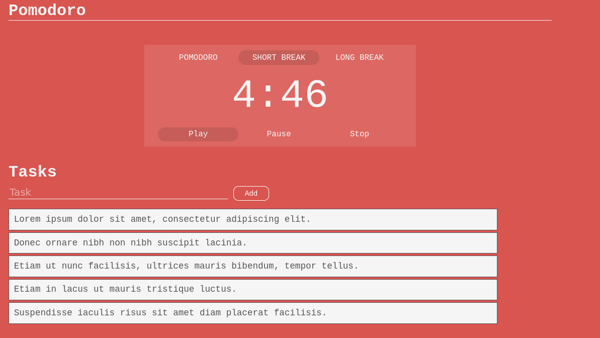

# Pomodoro With VueJS
A simple, pomodoro to-do list built with VueJS


## Development

- Clone the repo:

```bash
$ git clone https://github.com/danielcarpio/Pomodoro_With_VueJS
```

- Go to the project directory and start coding (no dependencies are needed to start developing):
```bash
$ cd Pomodoro_With_VueJS && code .
```
